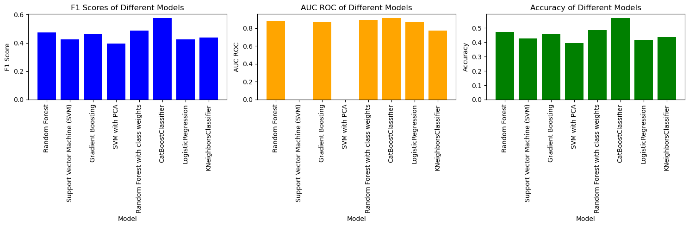

# Spotify-Genre-Predicting-Model
## Code-Pudding-Sept-24 Team: TuneTensor

## Description
This project builds a machine learning model that predicts the genre of a song using various metrics provided by Spotify. The goal is to create a predictive model that can  classify the genre of a song based on its features such as danceability, energy, tempo, and other characteristics.  Spotify API is used to retrieve these song metrics for a new track and make predictions on new songs.

## Setup Instructions:
1. Clone the repository:
    ```bash
    git clone https://github.com/zoeyespinoza/Spotify-Genre-Predicting-Model---Code-Pudding-Sept-24.git
    cd Spotify-Genre-Predicting-Model---Code-Pudding-Sept-24/
    ```

2. Install required packages:
    ```bash
    pip install -r requirements.txt
    ```

3. Set up the Spotify API:
    - Go to [Spotify Developer](https://developer.spotify.com/) and create an application.
    - Get your `client_id` and `client_secret`.

4. Use the following Python code to authenticate with the Spotify API:
    ```python
    import spotipy
    from spotipy.oauth2 import SpotifyClientCredentials

    client_id = "your-client-id"
    client_secret = "your-client-secret"

    sp = spotipy.Spotify(auth_manager=SpotifyClientCredentials(client_id=client_id, client_secret=client_secret))

    # Test
    result = sp.search(q='breath away', type='track', limit=1)
    print(result)
    ```
## Data Project
### Workflow:
## Data Workflow

1. **Collect Data**:
    - We use the Spotify API to collect song data and store it locally in `clean_spotify_set_2.csv`. The script updates the dataset automatically with new API calls, while checking for duplicates.

2. **Preprocess Data**:
    - Data is cleaned and preprocessed for model training. We normalize and encode relevant features like danceability, energy, etc., and handle missing data.

3. **Train Models**:
    - Train various machine learning models using the preprocessed data. Models include Random Forest, SVM, CatBoost, etc. Performance is evaluated using cross-validation and key metrics like accuracy, F1-score, and AUC-ROC.

4. **Evaluate Model Performance**:
    - Model evaluation focuses on key metrics, and predictions are compared across different genres. The best model (CatBoost) had an accuracy of 57%, while SVM struggled with AUC-ROC scores.

5. **Make Predictions**:
    - The trained model is used to predict the genre of new songs based on their Spotify audio features.

## Findings

### Included Genres:
We classified songs into the following genres:
- 'pop', 'rock', 'jazz', 'classical', 'hip-hop', 'metal', 'reggae', 'blues', 'country', 'edm', 'latin', 'soul', 'punk', 'folk', 'funk', 'indie', 'disco', 'r&b', 'gospel', 'alternative'

### Included Metrics:
Key audio features used in the models include:
- danceability, energy, key, loudness, mode, speechiness, acousticness, instrumentalness, liveness, valence, tempo

### Example: Classical Music
We found that classical music was consistently the most identifiable genre across different models.

Distribution of Spotify audio metrics.

Example: Classical music

 

## Model Performance:

We tested various models and collected the following metrics:

| Index | Model                              | F1        | AUC_ROC  | Accuracy  |
|-------|------------------------------------|-----------|----------|-----------|
| 0     | Random Forest                      | 0.472206  | 0.885439 | 0.471111  |
| 1     | Support Vector Machine (SVM)      | 0.424195  | NaN      | 0.426667  |
| 2     | Gradient Boosting                  | 0.464789  | 0.867793 | 0.457778  |
| 3     | SVM with PCA                      | 0.464789  | 0.867793 | 0.457778  |
| 4     | Random Forest with class weights    | 0.429641  | NaN      | 0.422222  |
| 5     | CatBoostClassifier                 | 0.574362  | 0.913466 | 0.568889  |
| 6     | Logistic Regression                | 0.424918  | 0.874830 | 0.417778  |
| 7     | KNeighbors Classifier              | 0.437653  | 0.773724 | 0.435556  |

 

## Conclusion
Conclusions about model performances, a table of the models' metrics, and graphs are provided.
- The **CatBoostClassifier** works best for the AUC_ROC, accuracy, and f1 metrics. Metrics for all the models tried were collected in the above table for easy comparison. A constant model would be right only 10% of the time. **CatBoost had an overall accuracy of .57**. Classification reports were generated for each model for ease of comparison across individual genres and models. Support Vector Machines are incompatible with roc_auc scores so a np.nan was left in that spot in the table and graphs.

### Reflections
- The easiest way to improve models' performances would be to add more data to the 'clean_spotify_set2.csv' file. The code has been set up to allow for automatic updating of the dataset to increase the variety of data it has to work with, while checking for duplicates.
- This code originally classified between 20 genres. The genres were shrunk to raise overall accuracy metrics for the models and allow the models to make clearer distinctions. The top ten most accurate genres from that list of 20 were chosen. Classical music consistently was the most identifiable across models. Of the original 20, the genre 'Soul' was least likely to be recognized which seems strangely appropriate of a computer. The API call still requests 20 different genres even though only ten were used for model training to try to keep the dataset as balanced as possible.
- The predict_genre() method was not able to be tested given certain restrictions with the API and relatively tight timeframe for this project.

## Members:

Ayyammal G. - Data Scientist [Github](https://github.com/ayyammal-g) - [Linkedin](https://www.linkedin.com/in/ayyammal-g-25462591/)

Erik M. - Data Scientist [Github](https://github.com/tempest-fugue) - [Linkedin]()

Zoey Espinoza - Data Scientist [Github](https://github.com/zoeyespinoza) - [Linkedin](https://www.linkedin.com/in/zoeyespinoza/)
